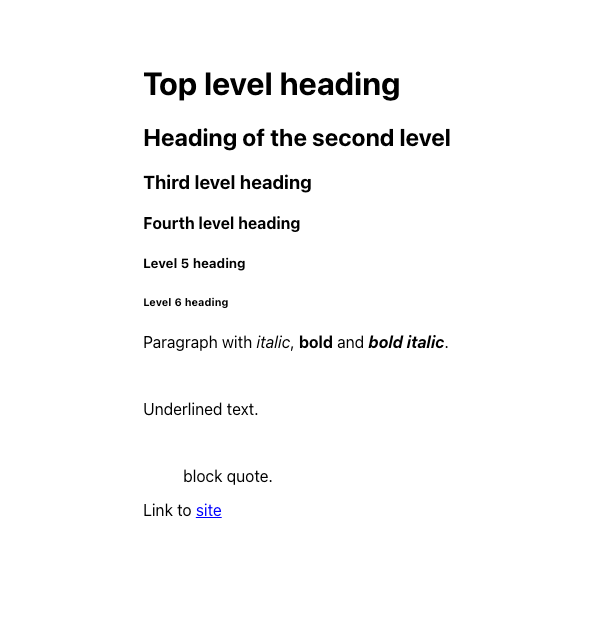

# react-native-awesome-markdown


## Installation

```sh
npm install react-native-awesome-markdown
```

## Usage

```js
import Markdown from 'react-native-awesome-markdown';

export default function App() {
  return (
    <View style={styles.container}>
      <Markdown text={TEST} />
    </View>
  );
}

const styles = StyleSheet.create({
  container: {
    flex: 1,
    alignItems: 'center',
    justifyContent: 'center',
  },
});

const TEST = `
# First level heading
## Heading of the second level
### Third level heading
#### Fourth level heading
##### Level 5 heading
###### Level 6 heading
plain text
**Thumbnail**
*Italic text*
***Bold italic text***
\`Code in a string\`
Link to [site](https://example.com)
`;

```

## Example



## Contributing

See the [contributing guide](CONTRIBUTING.md) to learn how to contribute to the repository and the development workflow.

## License

MIT
